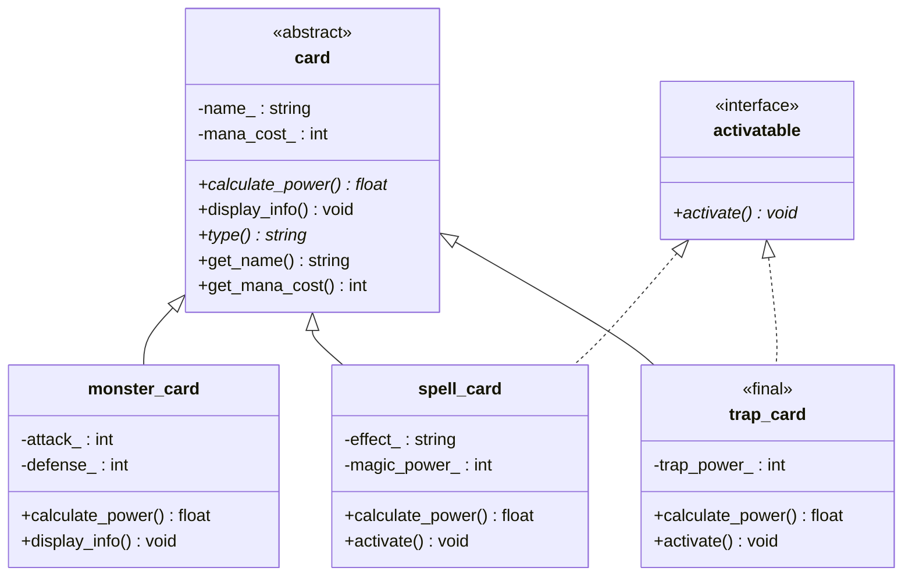

# Sistema-base-para-jogo-de-Cartas
Projeto POO - UFPB
por: Lucas Aprígio Santos de Oliveira    mat:20250019231

Descrição do Domínio:
  - Este projeto se trata de um sistema base para um jogo de cartas inspirados em jogos classicos como (gwent, yu-gi-oh, pokemon tcg).

## Diagrama UML


A relação entre o tabuleiro (game_board) e as cartas (card) é uma Agregação.
As cartas existem independentemente do "todo" (o tabuleiro). As cartas geralmente são criadas em um deck ou na mão do jogador antes de irem para o tabuleiro. Se o tabuleiro for destruído (por exemplo, se a rodada acabar), as cartas em si não devem ser deletadas da memória do sistema se ainda pertencerem ao deck do jogador.

A relação entre o jogador (player) e o seu tabuleiro (game_board) é uma Composição.
Nesse caso o ciclo de vida do tabuleiro está atrelado ao do jogador. Se o jogador sumir não tem sentido existir um tabuleiro.

A relação entre a partida (match) e o jogador (player) é uma Dependência (Uso).
A partida não possui o jogador como um atributo fixo de estrutura. Ela apenas interage com ele de forma pontual, recebendo-o como referência em seus métodos para extrair informações do estado atual do jogo (como pontos de vida e nickname).

## Uso de Smart Pointers

* **`player` usa `unique_ptr` para o `game_board`:** O jogador é o único dono do seu tabuleiro. Se o jogador for destruído, o tabuleiro é destruído automaticamente com ele.
* **`game_board` usa `shared_ptr` para as `card`s:** O tabuleiro apenas "pega emprestado" as cartas. Se o tabuleiro for destruído, as cartas continuam vivas na memória.
* **`main` usa `unique_ptr` para o `player`:** O sistema do jogo (`main`) é o único dono do jogador.
* **`main` usa `shared_ptr` para as `card`s:** As cartas nascem independentes no sistema do jogo e depois têm seu acesso compartilhado com o tabuleiro.

## Hierarquia de Herança (TP2)

A classe `card`, que no TP1 era concreta, foi transformada na base abstrata de uma
hierarquia de cartas. Além da herança simples, existe uma interface pura
(`activatable`) implementada via herança múltipla pelas cartas que possuem efeito
ativável. A partir do TP3, cada carta concreta também herda de `counted<Derived>`
(CRTP, ver seção "Programação Genérica" abaixo) — omitido do diagrama abaixo por
ser um mixin estático sem relação semântica de "é um" com o domínio.



Notação: o triângulo vazio (`<|--`) representa herança pública a partir da base
abstrata `card` (marcada `<<abstract>>`); a linha pontilhada com triângulo vazio
(`<|..`) representa a implementação da interface pura `activatable` (`<<interface>>`).

## Herança Avançada

* **`activatable` (interface pura):** não tem estado e todos os métodos são
  `= 0`. Modela a capacidade "pode ser ativada", que é ortogonal ao tipo de
  carta — `spell_card` e `trap_card` implementam essa capacidade,
  enquanto `monster_card` não, sem que isso exija reestruturar a hierarquia
  principal de `card`.
* **`spell_card` usa herança múltipla:** herda publicamente de `card` (é uma
  carta, com custo de mana e "poder") e de `activatable` (pode ser ativada em
  campo). Não há diamante, pois `card` e `activatable` não compartilham uma base
  comum com estado.
* **`trap_card` é marcada `final`:** cartas de armadilha, no domínio do
  jogo, têm um efeito de campo fixo e único (ativado quando o oponente
  cumpre uma condição). Permitir subclasses de `trap_card` abriria
  espaço para variações de comportamento que quebrariam essa garantia de
  design — toda armadilha deve continuar sendo, estritamente, uma carta com
  um único efeito reverso pré-definido. O `final` bloqueia isso em tempo de
  compilação.

---

# TP3 — Unidade III

## Programação Genérica

**O que o template `registry<T>` abstrai.** `registry<T>` (`src/generics.hpp`)
abstrai a ideia de "uma coleção que sabe adicionar e consultar itens por
índice", sem saber nada sobre o que é `T`. No `main()` ele é instanciado tanto
com `monster_card` (um tipo do domínio, com estado complexo e construtor que
valida) quanto com `int` (um tipo primitivo) — a mesma implementação serve
para os dois porque a abstração não depende de nenhuma característica
específica de `monster_card`.

**Por que CRTP em vez de herança virtual.** `counted<Derived>`
(`src/generics.hpp`), aplicado a `monster_card`, `spell_card` e
`trap_card`, precisa apenas de **um contador por classe derivada** e de
incrementar/decrementar esse contador em construção/destruição. Se isso fosse
feito com uma base virtual (`virtual void register_instance()`), cada
chamada pagaria uma indireção de vtable **em todo construtor e destrutor**,
para um comportamento que é decidido inteiramente em tempo de compilação (o
tipo `Derived` nunca muda em runtime). Com CRTP, `counted<monster_card>` e
`counted<spell_card>` são classes **distintas** geradas pelo compilador, cada
uma com seu próprio `count_` estático — sem nenhuma vtable envolvida e sem
nenhuma decisão em runtime.

**Concept `calculable` e `sum_total`.** O concept exige apenas
`calculate_power() const` convertível a `double` — a mesma assinatura que toda
`card` já expõe. `sum_total<calculable T>` usa isso para aceitar qualquer
tipo "calculável" por valor (não necessariamente uma `card`). Tentar
instanciar `sum_total` com `std::vector<int>` falha já na dedução de
template, com uma mensagem que aponta diretamente para
`calculable<T>` / `t.calculate_power()` — não uma cascata de erros de
centenas de linhas dentro do corpo da função (isso foi verificado na
prática; veja a nota em `generics.hpp`, logo acima de `sum_total`).

**Ranges: antes/depois.** O pipeline do Q1-E filtra cartas por custo de mana
e extrai os nomes:

```cpp
auto expensive_names = deck
    | rv::filter([](const auto& c) { return c->get_mana_cost() > 4; })
    | rv::transform([](const auto& c) { return c->get_name(); });
```

Antes (laço tradicional), seria necessário um vetor intermediário e dois
laços (ou um laço com `if` e `push_back` acumulando em outro `vector`):

```cpp
std::vector<std::string> old_expensive_names;
for (const auto& c : deck) {
    if (c->get_mana_cost() > 4) {
        old_expensive_names.push_back(c->get_name());
    }
}
```

A versão com ranges não aloca um vetor intermediário: `expensive_names` é uma
*view* preguiçosa — o filtro e a transformação só são aplicados quando o
`for` final percorre o resultado. Também deixa a **intenção** (filtrar, depois
transformar) mais explícita do que um único laço com lógica combinada.

## Tratamento de Erros

* **Hierarquia:** `game_error` (`src/errors.hpp`) herda de
  `std::runtime_error`; `invalid_card_error` (validação — nome vazio ou custo
  de mana negativo, lançada no construtor de `card`) e
  `resource_unavailable_error` (recurso ausente/esgotado — tabuleiro sem
  espaço em `game_board::play_card`, ou arquivo de estado ilegível em
  `json_repository`) herdam de `game_error`. O `main()` captura ambas
  **pela base**, num único `catch (const game_error& e)`.
* **`optional`:** `find_card_by_name` (`src/operations.hpp`) devolve
  `std::optional<std::reference_wrapper<const card>>` — `std::nullopt`
  quando a carta não existe no baralho, sem lançar exceção nem devolver
  ponteiro nulo.
* **`variant`:** `draw_card` devolve
  `draw_result = std::variant<std::unique_ptr<card>, std::string>` — a
  própria carta comprada ou uma mensagem de erro (baralho vazio). Tratado no
  `main()` com `std::visit` e `if constexpr`.

## STL e Concorrência

* **Containers:** `std::map<std::string, const card*>` indexa as cartas por
  nome em ordem alfabética (busca/iteração ordenada); `std::unordered_set<std::string>`
  guarda os tipos de carta presentes no baralho, garantindo unicidade com
  acesso médio O(1) — não são intercambiáveis: um não substitui o outro.
* **Algoritmos + lambda com captura:** `std::sort` (comparador por poder),
  `std::count_if` (lambda que **captura** `power_limit` por valor) e
  `std::accumulate` (soma do poder de todas as cartas) — nenhum laço manual
  equivalente foi escrito à mão.
* **Concorrência:** o cálculo de `calculate_power()` de cada carta é
  **independente por carta** (só lê o próprio estado, nunca o de outra),
  por isso é seguro disparar uma tarefa `std::async` por carta. Os
  `std::future<double>` são coletados com `.get()`, e a soma compartilhada
  (`parallel_sum`) é protegida por `std::mutex` + `std::lock_guard` na
  região crítica (a soma em si, não o cálculo).
* **ThreadSanitizer (Teste 6 do roteiro):** como cada tarefa só lê seu
  próprio objeto e a única escrita compartilhada (`parallel_sum`) está
  protegida por `lock_guard`, não há data race — não existe memória escrita
  por uma thread e lida por outra sem sincronização. Para confirmar, rode:
  `g++ -std=c++20 -pthread -fsanitize=thread -Isrc src/main.cpp -o app_tsan && ./app_tsan`
  (não incluído no `CMakeLists.txt` porque TSan é incompatível com o
  Address/UndefinedBehaviorSanitizer já configurado para o build normal).

## SOLID

* **SRP (Responsabilidade Única):** cada classe tem um motivo para mudar —
  `card`/derivadas só descrevem uma carta; `repository`/implementações só
  cuidam de persistência; `game` só orquestra salvar/carregar. Refatoração
  concreta: a lógica de persistir estado foi **extraída** de dentro do fluxo
  do `main()` para `json_repository`/`memory_repository`, em vez de o
  `main()` abrir arquivos e montar JSON diretamente.
* **OCP (Aberto/Fechado):** novas cartas podem ser adicionadas herdando de
  `card` (e implementando `calculate_power`/`type`) sem alterar código
  existente; novas formas de persistência podem ser adicionadas implementando
  `repository`, sem tocar em `game`. Ponto de extensão concreto:
  `repository` — uma futura `sqlite_repository`, por exemplo, não exigiria
  mudar `game` nem o restante do domínio.
* **LSP (Substituição de Liskov):** qualquer `card*`/`card&` (base) pode ser
  substituído por `monster_card`, `spell_card` ou `trap_card` sem
  quebrar o comportamento esperado por quem usa a base — é exatamente o que
  `highest_power_card` e o laço polimórfico do `main()` fazem, sem checar o
  tipo concreto. O mesmo vale para `repository` e suas duas implementações.
* **ISP (Segregação de Interfaces):** `activatable` é uma interface mínima e
  focada (só `activate()`) — cartas que não têm efeito ativável (`monster_card`)
  simplesmente não a implementam, em vez de herdar métodos que não usam.
* **DIP (Inversão de Dependência):** `game` (classe de alto nível) depende
  apenas da abstração `repository`, recebida por **injeção** no construtor
  (`explicit game(repository&)`) — nunca instancia `json_repository` ou
  `memory_repository` diretamente. Isso é o que permite testar `game` com
  `memory_repository` sem nenhum efeito colateral em disco (ver
  `tests/test_tp3.cpp`, caso "game usa memory_repository via DIP").
