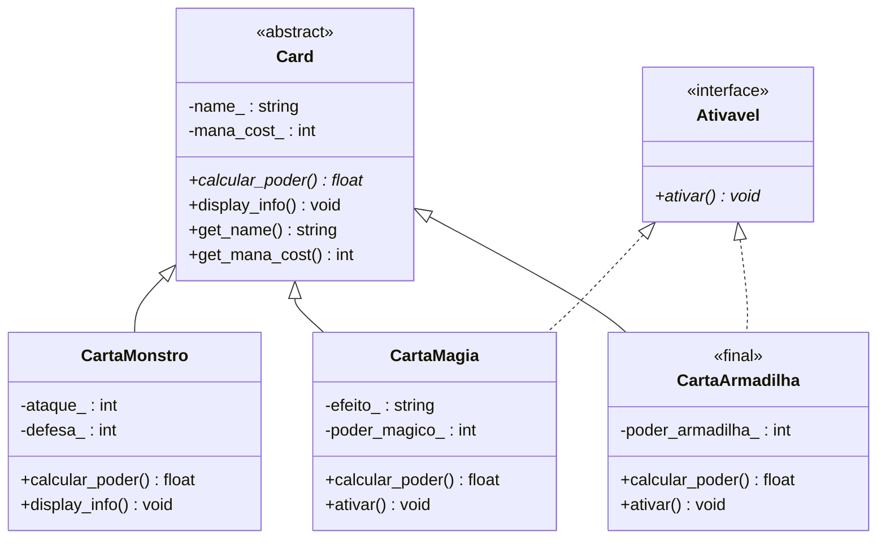

# Sistema-base-para-jogo-de-Cartas
Projeto POO - UFPB
por: Lucas Aprígio Santos de Oliveira    mat:20250019231

Descrição do Domínio:
  - Este projeto se trata de um sistema base para um jogo de cartas inspirados em jogos classicos como (gwent, yu-gi-oh, pokemon tcg).

## Diagrama UML

A relação entre o tabuleiro (GameBoard) e as cartas (Card) é uma Agregação.
As cartas existem independentemente do "todo" (o tabuleiro). As cartas geralmente são criadas em um deck ou na mão do jogador antes de irem para o tabuleiro. Se o tabuleiro for destruído (por exemplo, se a rodada acabar), as cartas em si não devem ser deletadas da memória do sistema se ainda pertencerem ao deck do jogador.

A relação entre o jogador (Player) e o seu tabuleiro (GameBoard) é uma Composição.
Nesse caso o ciclo de vida do tabuleiro está atrelado ao do jogador. Se o jogador sumir não tem sentido existir um tabuleiro.

A relação entre a partida (Match) e o jogador (Player) é uma Dependência (Uso).
A partida não possui o jogador como um atributo fixo de estrutura. Ela apenas interage com ele de forma pontual, recebendo-o como referência em seus métodos para extrair informações do estado atual do jogo (como pontos de vida e nickname).

## Uso de Smart Pointers

* **`Player` usa `unique_ptr` para o `GameBoard`:** O jogador é o único dono do seu tabuleiro. Se o jogador for destruído, o tabuleiro é destruído automaticamente com ele.
* **`GameBoard` usa `shared_ptr` para as `Card`s:** O tabuleiro apenas "pega emprestado" as cartas. Se o tabuleiro for destruído, as cartas continuam vivas na memória.
* **`main` usa `unique_ptr` para o `Player`:** O sistema do jogo (`main`) é o único dono do jogador.
* **`main` usa `shared_ptr` para as `Card`s:** As cartas nascem independentes no sistema do jogo e depois têm seu acesso compartilhado com o tabuleiro.

## Hierarquia de Herança (TP2)

A classe `Card`, que no TP1 era concreta, foi transformada na base abstrata de uma
hierarquia de cartas. Além da herança simples, existe uma interface pura
(`Ativavel`) implementada via herança múltipla pelas cartas que possuem efeito
ativável.

Notação: o triângulo vazio (`<|--`) representa herança pública a partir da base
abstrata `Card` (marcada `<<abstract>>`); a linha pontilhada com triângulo vazio
(`<|..`) representa a implementação da interface pura `Ativavel` (`<<interface>>`).

## Herança Avançada

* **`Ativavel` (interface pura):** não tem estado e todos os métodos são
  `= 0`. Modela a capacidade "pode ser ativada", que é ortogonal ao tipo de
  carta — `CartaMagia` e `CartaArmadilha` implementam essa capacidade,
  enquanto `CartaMonstro` não, sem que isso exija reestruturar a hierarquia
  principal de `Card`.
* **`CartaMagia` usa herança múltipla:** herda publicamente de `Card` (é uma
  carta, com custo de mana e "poder") e de `Ativavel` (pode ser ativada em
  campo). Não há diamante, pois `Card` e `Ativavel` não compartilham uma base
  comum com estado.
* **`CartaArmadilha` é marcada `final`:** cartas de armadilha, no domínio do
  jogo, têm um efeito de campo fixo e único (ativado quando o oponente
  cumpre uma condição). Permitir subclasses de `CartaArmadilha` abriria
  espaço para variações de comportamento que quebrariam essa garantia de
  design — toda armadilha deve continuar sendo, estritamente, uma carta com
  um único efeito reverso pré-definido. O `final` bloqueia isso em tempo de
  compilação.
